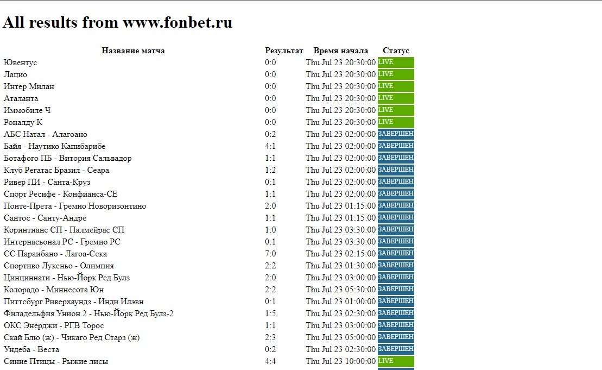

## Test task: Scraping using aiohttp
Main web-scraping file parser.py.

Information saves in database MongoDB using motor and pymongo.

#### Implement:
  1. used aiohttp for request and as server Framework
  2. for scraping information access to api web site
  4. use Celery and Redis for run scraping in the background
  
  
#### Urls:
1. main page with list of all results  ```/```

2. list of filtered results by firs letter ```/<letter>```


### Running project

To get this project up and running you should start by having Python installed on your computer. It's advised you create a virtual environment to store your projects dependencies separately. You can install virtualenv with

```
pip install virtualenv
```

Clone or download this repository and open it in your editor of choice. In a terminal (mac/linux) or windows terminal, run the following command in the base directory of this project

```
virtualenv env
```

That will create a new folder `env` in your project directory. Next activate it with this command on mac/linux:

```
source env/bin/active
```
 or 
 ```
 env\Scripts\activate
```

Then install the project dependencies with

```
pip install -r requirements.txt
```

Setup MongoDB settings in ```config.yaml```


Run the project with starting file ```entry.py```

